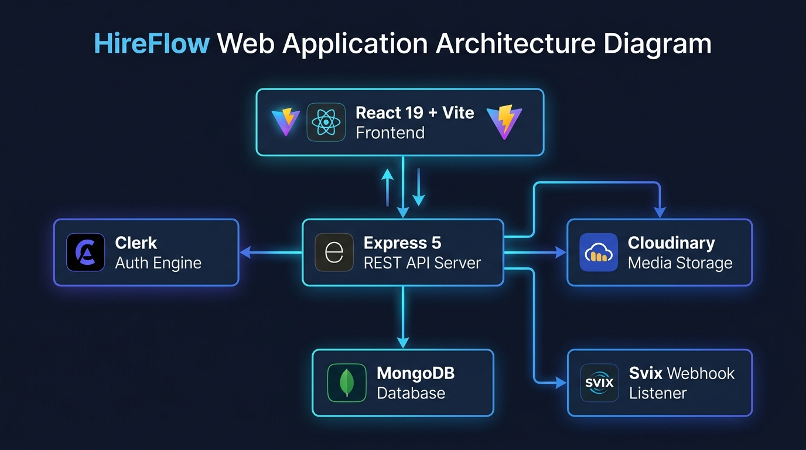
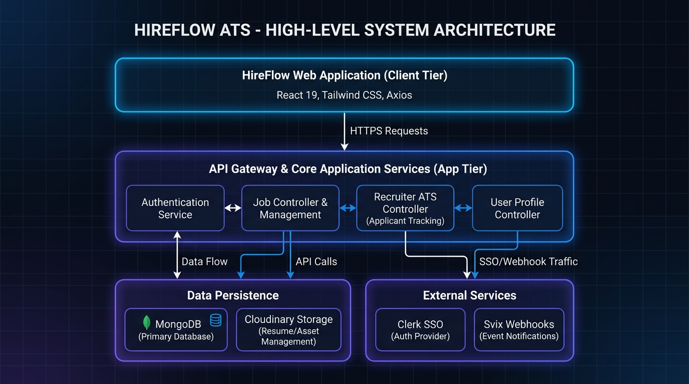

# 🚀 HireFlow — Enterprise Job Portal & Applicant Tracking System (ATS)

<p align="center">
  
</p>

<p align="center">
  <b>A modern, full-stack recruitment platform connecting top talent with hiring companies.</b>
</p>

<p align="center">
  
  
  
  
  
  
  
</p>

---

## 🌐 Live Deployment & Links

- **API Backend Server (Render)**: [https://hireflow-4k6n.onrender.com](https://hireflow-4k6n.onrender.com)
- **Frontend App**: Deployed & connected via Render backend environment.

---

## 📌 Executive Summary

**HireFlow** is an end-to-end recruitment platform engineered to streamline the hiring process for both **Job Seekers** and **Corporate Recruiters**. Built with high performance, scalability, and developer experience in mind, HireFlow combines **Clerk OAuth** for seamless candidate authentication, a **JWT corporate portal** for employers, **Quill rich-text job publishing**, dynamic multi-criteria job filtering, and a cloud media pipeline powered by **Cloudinary** for resume & logo uploads.

---

## 📐 System Architecture & Data Flow

<p align="center">
  
</p>

```
                               ┌───────────────────────────┐
                               │     React 19 Frontend     │
                               │   (Vite + Tailwind v4)    │
                               └─────────────┬─────────────┘
                                             │
                      ┌──────────────────────┼──────────────────────┐
                      │                      │                      │
              REST API Calls (Axios)    Clerk Auth               JWT Tokens
                      │                      │                      │
                      ▼                      ▼                      ▼
           ┌─────────────────────┐ ┌──────────────────┐ ┌────────────────────┐
           │ Express 5 API Server│ │ Clerk SSO Engine │ │ Corporate Auth     │
           │  (Node.js / ESM)    │ └─────────┬────────┘ └────────────────────┘
           └──────────┬──────────┘           │
                      │               Svix Webhook Sync
                      ├──────────────────────┘
                      │
     ┌────────────────┼────────────────┐
     ▼                ▼                ▼
┌──────────┐    ┌───────────┐    ┌───────────┐
│ MongoDB  │    │Cloudinary │    │   Svix    │
│ Mongoose │    │ (Resumes/ │    │ Webhooks  │
│ Database │    │  Logos)   │    └───────────┘
└──────────┘    └───────────┘
```

---

## 🏗 High-Level Design (HLD) Architecture

<p align="center">
  
</p>

The HireFlow ATS platform follows a multi-tiered corporate software architecture:
1. **Presentation Tier (Client)**: Built with React 19, Tailwind CSS v4, and Axios for responsive UI rendering and async API communication.
2. **Application & Gateway Tier (App Server)**: Powered by Node.js and Express 5, managing JWT-based employer session tokens, Clerk SSO middleware, business controllers (Job, User, Recruiter ATS), and CORS security policies.
3. **Data & External Services Tier**:
   - **Data Persistence**: MongoDB Database with Mongoose ODM for relational modeling (`Users`, `Companies`, `Jobs`, `JobApplications`).
   - **Asset Storage**: Cloudinary media CDN for candidate resume PDFs and employer logos.
   - **Identity & Events**: Clerk OAuth authentication and Svix cryptographically signed event webhooks (`user.created`, `user.updated`).

---

## ✨ Key Features & User Personas

### 👤 1. Job Seeker (Candidate) Portal
- **OAuth & Passwordless Authentication**: Secure sign-in/sign-up powered by **Clerk** (Google SSO, Email verification).
- **Smart Multi-Criteria Job Discovery**: Filter open positions by **Job Title**, **Location**, **Category**, and **Salary Range** in real-time.
- **Rich Job Details & Company Profiles**: Comprehensive job descriptions with requirements, location tags, and corporate branding.
- **Cloud Resume Upload**: Instant resume attachment (PDF/Doc) backed by Cloudinary media storage.
- **Application Status Dashboard**: Track applied jobs with real-time status indicators (`Pending`, `Accepted`, `Rejected`) and submission timestamps formatted via **Moment.js**.

### 🏢 2. Corporate Recruiter (Employer ATS) Portal
- **Dedicated Corporate Login & JWT Auth**: Secure corporate authentication for employer accounts with custom token session state.
- **Quill Rich-Text Job Editor**: Format job descriptions with headers, bullet points, requirement lists, and custom styling using **Quill.js**.
- **Job Lifecycle Management**: Post new listings, view applicant counts per job, toggle visibility (`Active` vs. `Hidden`), or remove expired listings.
- **Applicant Tracking System (ATS)**: View all candidate submissions, review applicant profile info, and view/download resume PDFs.
- **1-Click Candidate Decisioning**: Update application status (`Accepted` / `Rejected`) with immediate database sync and candidate notifications.

---

## 🛠 Tech Stack & Ecosystem

| Layer | Technology | Purpose |
| :--- | :--- | :--- |
| **Frontend Framework** | **React 19** + **Vite 8** | High-performance SPA frontend with lightning-fast HMR |
| **Styling & UI** | **Tailwind CSS v4**, **Lucide Icons** | Modern design system, responsive glassmorphism aesthetic |
| **Rich Text Editor** | **Quill.js** (`quill`) | Formatting job post descriptions with rich media support |
| **Candidate Auth** | **@clerk/react** & **@clerk/express** | User authentication, identity management, and OAuth |
| **Backend Runtime** | **Node.js (ESM)** + **Express 5** | Scalable REST API with modern Express v5 routing middleware |
| **Database ODM** | **MongoDB** + **Mongoose 9** | NoSQL document database for Jobs, Users, Companies, Applications |
| **Cloud Storage** | **Cloudinary** + **Multer** | Secure cloud storage for company logo graphics & resume PDFs |
| **Webhooks** | **Svix** | Reliable, cryptographically verified user sync from Clerk to MongoDB |
| **HTTP Client & Utils** | **Axios**, **Moment.js**, **React Toastify** | API communication, date formatting, and feedback notifications |

---

## 📋 Database Schemas

- **`User`**: `clerkId`, `name`, `email`, `image`, `resume`
- **`Company`**: `name`, `email`, `password`, `image` (Cloudinary URL)
- **`Job`**: `title`, `description`, `location`, `category`, `level`, `salary`, `date`, `visible`, `companyId`
- **`JobApplication`**: `userId`, `companyId`, `jobId`, `status` (`Pending` \| `Accepted` \| `Rejected`), `date`

---

## 🔌 API Endpoints Reference

### 🏢 Company & Recruiter (`/api/company`)
- `POST /api/company/register` — Register a new employer company (Logo upload via Multer/Cloudinary)
- `POST /api/company/login` — Authenticate company & receive JWT token
- `GET /api/company/company` — Fetch authenticated company profile data
- `POST /api/company/post-job` — Publish a new job position
- `GET /api/company/list-jobs` — Fetch all jobs created by the authenticated company
- `POST /api/company/change-visibility` — Toggle job visibility (`visible: true/false`)
- `GET /api/company/applicants` — Retrieve all candidate applications for company listings
- `POST /api/company/change-status` — Accept or Reject candidate applications

### 💼 Jobs Portal (`/api/jobs`)
- `GET /api/jobs` — Get all visible active job listings
- `GET /api/jobs/:id` — Get single job details by ID

### 👤 User Candidate (`/api/users`)
- `GET /api/users/user` — Fetch user profile data
- `POST /api/users/apply` — Submit job application
- `GET /api/users/applications` — Fetch candidate's submitted applications
- `POST /api/users/update-resume` — Upload/Update candidate resume PDF

### ⚡ Webhooks (`/webhooks`)
- `POST /webhooks` — Svix verified Clerk event listener (`user.created`, `user.updated`, `user.deleted`)

---

## 💻 Local Installation & Setup

### Prerequisites
- **Node.js**: `v18+` or `v20+`
- **pnpm** or **npm**
- **MongoDB**: Local URI or MongoDB Atlas Cluster
- **Clerk Account**: Publishable Key & Secret Key
- **Cloudinary Account**: Cloud Name, API Key & Secret

### 1. Clone Repository
```bash
git clone https://github.com/Vaibhav5122/HireFlow.git
cd HireFlow
```

### 2. Configure Server Environment (`server/.env`)
Create a `.env` file in the `server/` directory:
```env
PORT=8001
MONGODB_URI=mongodb+srv://<username>:<password>@cluster.mongodb.net/hireflow
CLERK_PUBLISHABLE_KEY=pk_test_...
CLERK_SECRET_KEY=sk_test_...
CLERK_WEBHOOK_SECRET=whsec_...
JWT_SECRET=your_jwt_secret_key
CLOUDINARY_NAME=your_cloudinary_name
CLOUDINARY_API_KEY=your_api_key
CLOUDINARY_SECRET_KEY=your_secret_key
FRONTEND_ORIGIN=http://localhost:5173
```

### 3. Configure Client Environment (`client/.env`)
Create a `.env` file in the `client/` directory:
```env
VITE_CLERK_PUBLISHABLE_KEY=pk_test_...
VITE_BACKEND_URL=https://hireflow-4k6n.onrender.com
```

### 4. Install Dependencies & Run Locally
```bash
# Server Setup
cd server
pnpm install # or npm install
pnpm dev

# Client Setup (in a new terminal window)
cd client
pnpm install # or npm install
pnpm dev
```

Open `http://localhost:5173` in your browser to view the app!

---

## 💡 Strategic Engineering Suggestions & Production Enhancements
*(Recommendations for scaling HireFlow for enterprise HR tech)*

1. **🤖 AI-Powered Candidate-Job Matching**:
   - Integrate OpenAI or Gemini Embeddings API to compare candidate resume text against job descriptions and compute an **ATS Fit Score (%)**.
2. **📧 Automated Email & SMS Notifications**:
   - Implement **Nodemailer / Resend** or **Twilio** to send real-time email alerts when a candidate's application status is updated to *Accepted* or *Rejected*.
3. **📊 Recruiter Analytics & Metrics Dashboard**:
   - Add chart visualizations (via Chart.js or Recharts) displaying **Time-to-Hire**, **Applicant Funnel conversion rates**, and **Top Hiring Categories**.
4. **📅 Interview Scheduling Integration**:
   - Embed Google Calendar / Calendly API integration allowing recruiters to schedule 1-on-1 interview slots directly from the applicant review screen.
5. **🔒 Role-Based Access Control (RBAC)**:
   - Expand employer permissions to support multi-user hiring teams with granular roles (`Admin`, `Hiring Manager`, `Interviewer`, `Viewer`).

---

<p align="center">
  Designed & Built with ❤️ by <b>Vaibhav</b>
</p>
